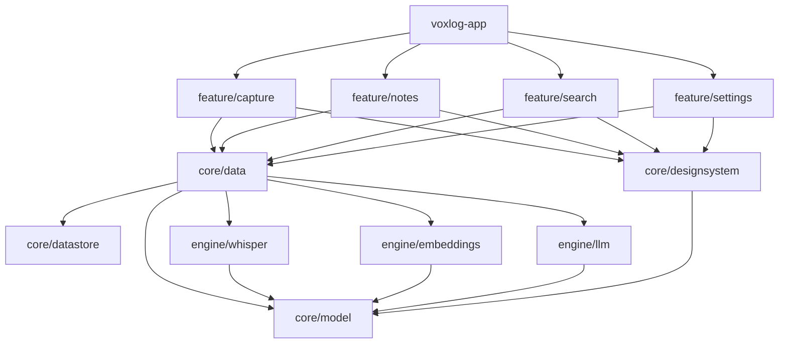
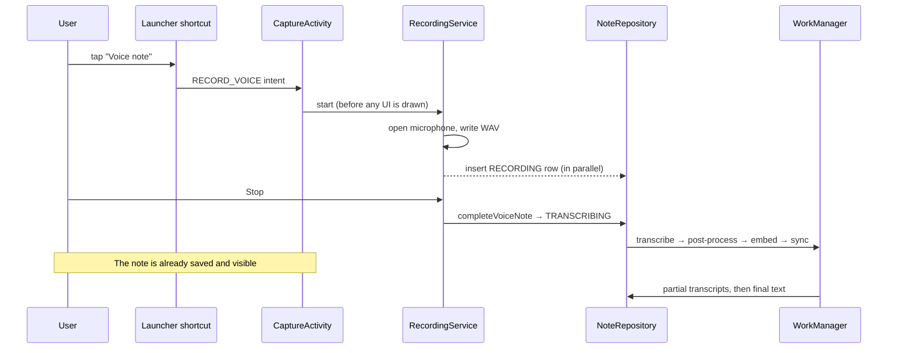

# Architecture

VoxLog is a single-activity-per-entry-point Android app built with Kotlin, Jetpack Compose and a
modular Gradle build. The design goals, in priority order:

1. **Capture latency.** The voice shortcut must reach a live microphone in well under a second.
2. **Never lose a note.** Persistence happens before anything slow, and every crash path recovers.
3. **Local first.** Everything works offline; network features are optional add-ons.
4. **Small, testable units** with enforced boundaries.

## Module graph

Rules, enforced in CI by the module-graph assertion plugin (`build.gradle.kts`) and Konsist
(`voxlog-architecture-tests`):

- `app → feature → core/engine`. Features never depend on other features.
- `core/model` depends on nothing and has no Android imports.
- Engines depend only on `core/model`. They are pure compute: no database, no settings, no UI.
- UI code never touches DAOs or the database; ViewModels talk to repositories and services.

## Layers

| Layer | Lives in | Responsibility |
|---|---|---|
| UI | `feature/*` (`*Screen`, `*Route`) | Stateless composables rendering an immutable `UiState`. |
| Presentation | `feature/*` (`*ViewModel`) | Unidirectional data flow: `StateFlow<UiState>` out, actions in. |
| Domain model | `core/model` | Plain Kotlin types (`Note`, `Category`, `NoteFilter`, …). |
| Data | `core/data` | Repositories (interfaces + Room implementations), pipeline workers, search, export, sync. |
| Engines | `engine/*` | Speech-to-text, embeddings, LLM and HTTP clients. |
| Platform glue | `feature/capture`, `voxlog-app` | Foreground service, activities, shortcuts. |

## The capture pipeline

Key properties:

- **Microphone first.** `RecordingService` generates the note id, opens `AudioRecord` and only then
  persists the row, so database latency never delays the first audio sample.
- **No time limit.** Recording only stops on Stop or when free storage drops below 20 MB. The record
  screen warns when less than 30 minutes of storage remain.
- **Crash safety.** The WAV is flushed continuously and the note row exists in the `RECORDING` state.
  On the next launch `CaptureRecovery` repairs the WAV header and queues transcription.
- **Background everything else.** Transcription, AI processing, embedding and folder sync run in
  WorkManager and update the note reactively through Room flows. Long transcriptions run as a
  foreground worker so they finish with the app closed.

## Dependency injection

Hilt. Interfaces are bound in `core/data/di/DataModule.kt` and `core/datastore`. Tests swap in
fakes from `core/testing` instead of mocks.

## Build logic

Convention plugins in `build-logic/convention` configure every module consistently
(`voxlog.android.library`, `voxlog.android.feature`, `voxlog.android.compose`, `voxlog.android.room`,
`voxlog.hilt`, `voxlog.jvm.library`). All versions live in `gradle/libs.versions.toml`.
Every module gets Spotless (ktlint), detekt (with Compose rules), Kover and Dokka automatically.
