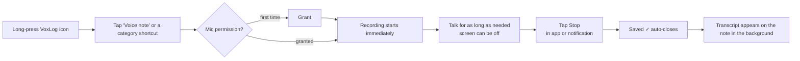
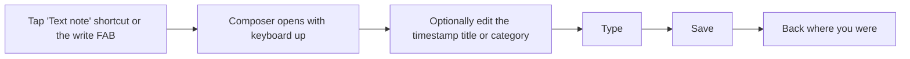
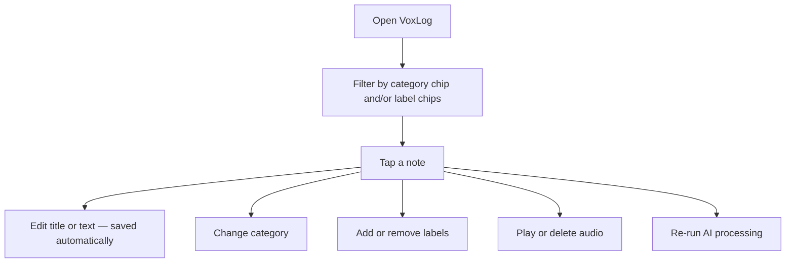
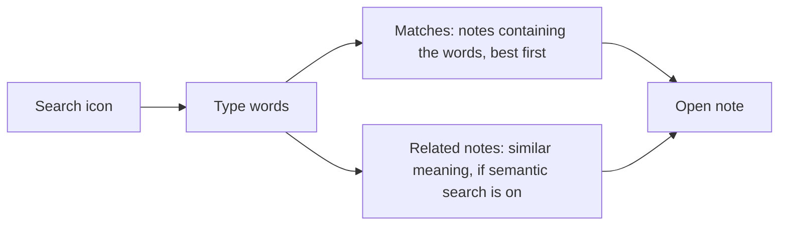
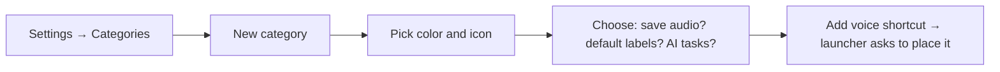
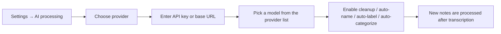
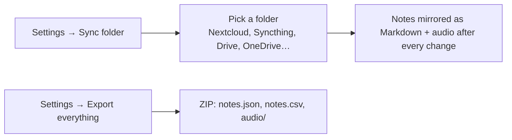

# User flows

## Quick voice note from the home screen shortcut

## Typed note

## Review and organize

## Find something

## Set up a category with its own shortcut

## Optional AI processing

## Back up and sync

